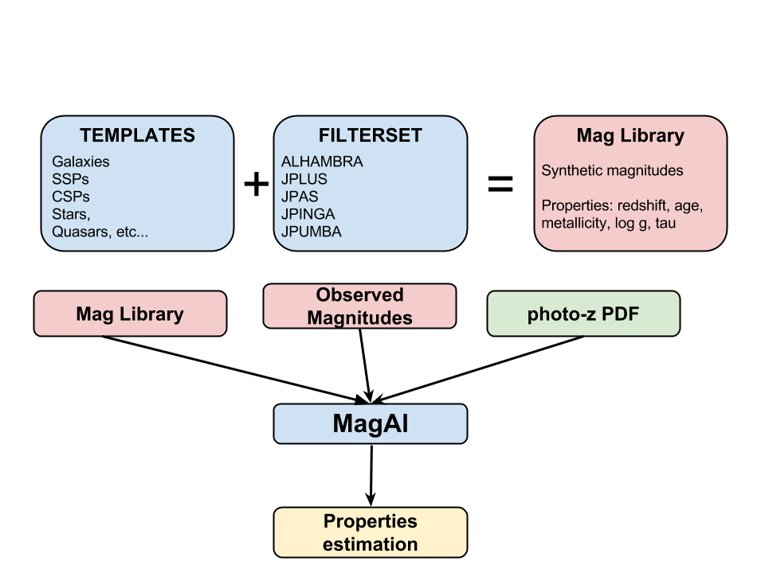

-------------------------------
MagAl - The magnitudes Analyzer
-------------------------------

.. rst-class:: align-right

  *I wanna see her smiling, I wanna see her singing!*

Who it works?
^^^^^^^^^^^^^

How MagAl works? Which public? whatever...

Contents
^^^^^^^^

.. toctree::
   :maxdepth: 2

   installation
   filtersets
   libraries
   input
   fitting
   plotting
   examples
   license

Developer information
^^^^^^^^^^^^^^^^^^^^^
.. toctree::
   :maxdepth: 1

   structure
   api

..   plotting
   examples

Indices and tables
^^^^^^^^^^^^^^^^^^

* :ref:`genindex`
* :ref:`modindex`
* :ref:`search`

